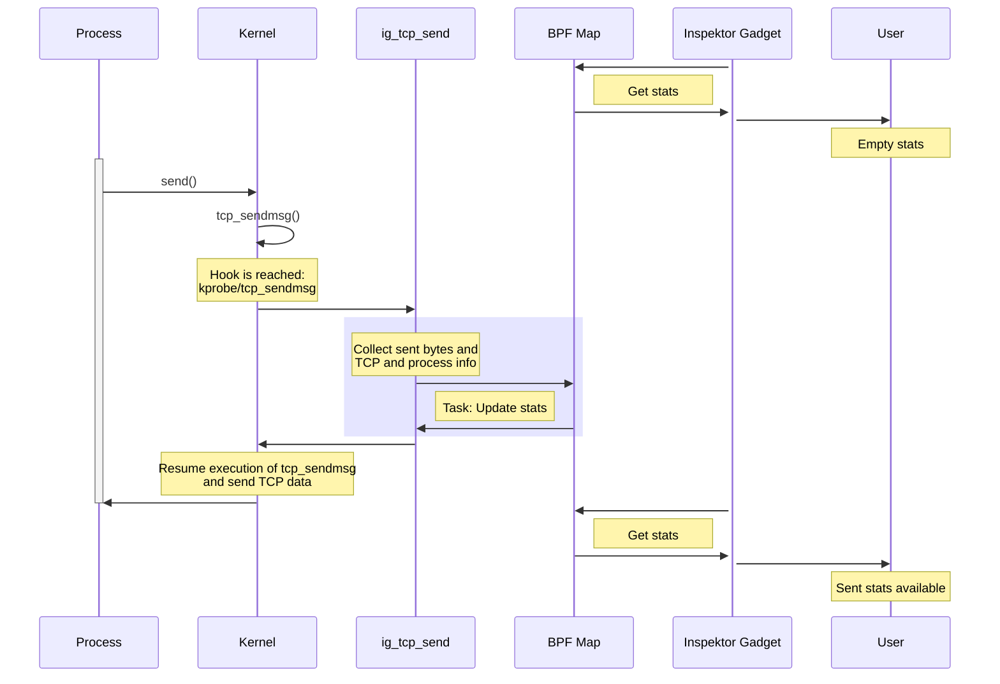

# Hands-on: Collect statistics about TCP connections with a gadget

In this hands-on session, you will learn how to write a gadget that collects
statistics about TCP connections. In particular, the gadget should keep track of
the number of bytes sent and received by each TCP connection.

For time constraints, we will provide you with a gadget that is almost complete
and your task is to have fun completing it!

## Environment setup

We prepared a set of virtual machines with all the dependencies ready for this
contribfest. We'll give you instruction on the section to connect to them.

The environment has:

- A running minikube cluster deployed
- `ig` and `kubectl gadget` binaries installed to handle gadgets
- Inspektor Gadget deployed to the cluster
- Prometheus and Grafana deployed to the cluster

## Walking through the eBPF code

The eBPF code is available in the `task/program.bpf.c` file. Let's walk
through it to understand what it does:

- [Data source and map definition](#data-source-and-map-definition)
- [Hooks](#hooks)
- [Programs](#programs)

### Data source and map definition

When computing statistics, we don't want to generate a stream of events every
time a TCP connection sends or receives data. Instead, it's more efficient to
keep statistics on kernel side and only copy them to user space periodically. To
achieve that, we define a
[Map Iterator data source](https://inspektor-gadget.io/docs/latest/gadget-devel/gadget-intro#map-iterators)
to make Inspektor Gadget pull periodically those values:

```c
struct {
  __uint(type, BPF_MAP_TYPE_HASH);
  __uint(max_entries, 10240);
  __type(key, struct key_t);
  __type(value, struct value_t);
} stats SEC(".maps");

GADGET_MAPITER(tcp, stats);
```

Now, let's see what information the [key](#map-key) and [value](#map-value)
structs contain.

### Map key

Given a TCP connection is identified by the tuple: source address, source port,
destination address and destination port; those are the obvious values to use as
a key. However, users may be also interested in having those statistics per
process or container. So, we will include also that information in the key:

```c
struct key_t {
  gadget_pid pid;
  gadget_tid tid;
  gadget_comm comm[TASK_COMM_LEN];

  gadget_mntns_id mntns_id;

  struct gadget_l4endpoint_t src;
  struct gadget_l4endpoint_t dst;
};
```

Let's see some of the benefits of using `gadget_*` types:

- In case the process sending/receiving TCP traffic is running within a
  container, adding the mount namespace ID to the key, with type
  [gadget_mntns_id](https://inspektor-gadget.io/docs/latest/gadget-devel/gadget-ebpf-api#gadget_mntns_id-and-gadget_netns_id),
  will make Inspektor Gadget to automatically enrich those statistics
  with the corresponding container metadata.
- Using
  [struct gadget_l4endpoint_t](https://inspektor-gadget.io/docs/latest/gadget-devel/gadget-ebpf-api#struct-gadget_l4endpoint_t)
  will improve the way this information is displayed in the CLI and, in
  case we run the gadget in Kubernetes and the address correspond to a
  pod or service, Inspektor Gadget will show the pod/service name instead
  of the raw address.
- In general, using `gadget_*` types will improve the UX and provide several
  features for free, see [Enriched types](https://inspektor-gadget.io/docs/latest/gadget-devel/gadget-ebpf-api#enriched-types)
  for further information.

### Map value

The value struct contains the statistics we are collecting, in this case the
number of bytes sent and received:

```c
struct value_t {
  size_t sent;
  size_t received;
};
```

### Hooks

Given that we want to compute sent and receive bytes statistics per TCP
connections, these are the hooks the gadget will use:

- [kprobe/tcp_sendmsg](https://github.com/torvalds/linux/blob/14b6320953a3f856a3f93bf9a0e423395baa593d/net/ipv4/tcp.c#L1352):
  Function in charge of sending TCP data. It receives the following parameters:
  - [struct sock *sk](https://linux-kernel-labs.github.io/refs/heads/master/labs/networking.html#the-struct-sock-structure): The network layer representation of the socket.
  - `struct msghdr *msg`: The message to send.
  - `size_t size`: The number of bytes to send.
- [kprobe/tcp_cleanup_rbuf](https://github.com/torvalds/linux/blob/14b6320953a3f856a3f93bf9a0e423395baa593d/net/ipv4/tcp.c#L1508):
  Function in charge of cleaning up the receive buffer for full TCP frames taken
  by the user. It receives the following parameters:
  - [struct sock *sk](https://linux-kernel-labs.github.io/refs/heads/master/labs/networking.html#the-struct-sock-structure): The network layer representation of the socket.
  - `int copied`: The number of bytes copied to the user.

  Notice that we are not using `tcp_recvmsg` to track received bytes for two
  reasons:
  - We would need to trace both entry and return, to have both sock struct and size.
  - We would miss traffic sent with
    [tcp_read_sock()](https://github.com/torvalds/linux/blob/14b6320953a3f856a3f93bf9a0e423395baa593d/net/ipv4/tcp.c#L1556-L1567),
    which offers significant performance benefits to applications such as `ftp`
    and web servers that need to efficiently transfer files.

### Programs

The following diagram shows the sequence of events when a TCP connection sends
data:



The goal of those two programs is to get the TCP and process information and
store the statistics in the map. We already provide you with the code that get
the TCP and process information, so you only need to complete the code that
stores the bytes sent or received in the map. To do that, you can use the bpf
helper functions:

- [`bpf_map_lookup_elem`](https://docs.ebpf.io/linux/helper-function/bpf_map_lookup_elem/): Perform a lookup in map for an entry associated to key.
- [`bpf_map_update_elem`](https://docs.ebpf.io/linux/helper-function/bpf_map_update_elem/): Update values in a map.

Let's code!

## Generating an UUID for our gadget

We'll using ttl.sh to push our gadget to a container registry. Let's generate an
uuid for our gadget to avoid colliding with other folks.

:alert:

This is only needed because we're using ttl.sh to ease this contribfest. If you
are pushing to your own registry you won't need it.

UUID=$(uuidgen)

## Building your gadget

To test your code, you can build the gadget by running this command:

```bash
sudo -E ig image build . -t ttl.sh/$UUID/tcp-gadget:latest
```

For your information,
[here](https://www.inspektor-gadget.io/docs/latest/gadget-devel/building) the full
documentation on how to build a gadget.

## Running your gadget in Kubernetes

In order to be able to run your gadget in Kubernetes, you need to push it to a
container registry. You can do that by pushing the image to the ttl.sh registry
which doesn't require authentication:

```bash
sudo -E ig image push ttl.sh/$UUID/tcp-gadget:latest
```

You can run your gadget by using:

```bash
kubectl gadget run ttl.sh/$UUID/tcp-gadget:latest
```

As you can see, the gadget is not complete yet as it's not printing any output.
Your task is to fix the `/* TODO: Add code for adding these new values to the
map */` in the gadget.

Check the official documentation if you want to know more about
[running](https://www.inspektor-gadget.io/docs/latest/reference/run) gadgets in
Kubernetes.

## Solution: Completing the gadget

For the solution, you should have considered two cases when storing the
statistics in the map:

- It's the first time we store statistics for a given key.
- We already have some statistics for that key. In the first case we add a new
  entry to the map, while in the second we just need to increase the counter for
  that key.

The code to complete the gadget could look like this:

```c
  struct value_t *trafficp = bpf_map_lookup_elem(&stats, &key);
  if (!trafficp) {
    struct value_t zero;

    if (receiving) {
      zero.sent = 0;
      zero.received = size;
    } else {
      zero.sent = size;
      zero.received = 0;
    }

    bpf_map_update_elem(&stats, &key, &zero, BPF_NOEXIST);
  } else {
    if (receiving)
      trafficp->received += size;
    else
      trafficp->sent += size;

    bpf_map_update_elem(&stats, &key, trafficp, BPF_EXIST);
  }
```

Run the gadget again and check the output. Notice the `--pull always` flag that
will make the gadget to pull the latest image from the registry.

```bash
$ kubectl gadget run ttl.sh/$UUID/tcp-gadget:latest -A --pull always
K8S.NODE                       K8S.NAMESPACE                  K8S.PODNAME                    K8S.CONTAINERNAME                           PID              TID COMM             SRC              DST              SENT             RECEIVED
K8S.NODE                       K8S.NAMESPACE                  K8S.PODNAME                    K8S.CONTAINERNAME                           PID              TID COMM             SRC              DST              SENT             RECEIVED
minikube                       kube-system                    etcd-minikube                  etcd                                       5878             5929 etcd             127.0.0.1:2379   127.0.0.1:60062  65               0
minikube                       kube-system                    kube-apiserver-minikube        kube-apiserver                             5830             5911 kube-apiserver   127.0.0.1:60376  127.0.0.1:2379   0                39
minikube                       kube-system                    kube-controller…nager-minikube kube-controller-manager                    5848             6161 kube-controller  192.168.49.2:55… 192.168.49.2:84… 0                671
minikube                       kube-system                    etcd-minikube                  etcd                                       5878             5929 etcd             127.0.0.1:2379   127.0.0.1:60022  0                129
minikube                       kube-system                    coredns-6f6b679f8f-xc982       coredns                                    6487             6504 coredns          127.0.0.1:45506  127.0.0.1:8080   92               118
minikube                       kube-system                    etcd-minikube                  etcd                                       5878             5929 etcd             127.0.0.1:2379   127.0.0.1:60248  39               52
minikube                       kube-system                    kube-apiserver-minikube        kube-apiserver                             5830             5956 kube-apiserver   127.0.0.1:60022  127.0.0.1:2379   52               2103
minikube                       kube-system                    kube-apiserver-minikube        kube-apiserver                             5830             5903 kube-apiserver   127.0.0.1:59956  127.0.0.1:2379   0                65
minikube                       monitoring                     prometheus-569cc664c8-tmjd4    prometheus                                15921            15939 prometheus       p/monitoring/pr… p/gadget/gadget… 0                2369
minikube                       kube-system                    kube-apiserver-minikube        kube-apiserver                             5830             5901 kube-apiserver   127.0.0.1:60268  127.0.0.1:2379   0                39
minikube                       kube-system                    kube-apiserver-minikube        kube-apiserver                             5830             5901 kube-apiserver   127.0.0.1:59996  127.0.0.1:2379   52               0
minikube                       kube-system                    kube-apiserver-minikube        kube-apiserver                             5830             5956 kube-apiserver   127.0.0.1:60268  127.0.0.1:2379   52               0
minikube                       kube-system                    etcd-minikube                  etcd                                       5878             5953 etcd             127.0.0.1:2379   127.0.0.1:60268  39               0
minikube                       kube-system                    kube-apiserver-minikube        kube-apiserver                             5830             5911 kube-apiserver   127.0.0.1:59956  127.0.0.1:2379   0                39
minikube                       kube-system                    kube-apiserver-minikube        kube-apiserver                             5830             5911 kube-apiserver   127.0.0.1:59914  127.0.0.1:2379   52               0
```

## Exporting metrics

### Configuring the gadget to export metrics

Now, we will export the received and sent bytes statistics to Prometheus as
counters. To do that you need to do the following changes to the metadata file:

- Set the `metrics.collect` annotation to `"true"` for the data source:

```yaml
datasources:
  tcp:
    annotations:
      metrics.collect: "true"
```

- Set the `metrics.type` annotation to `counter` for the `received` and `sent`
  fields. And, set the `metrics.type` annotation to `key` for the fields we want
  to use as labels for the metrics, such as `comm`. This is an example of how to
  annotate the fields:

```yaml
datasources:
  tcp:
    annotations:
      [...]
    fields:
      myField: # Replace myField with the field you want to annotate
        annotations:
          metrics.type: counter # use key for the ones you want to use as labels
          description: My field description
```

  Notice you can also use as `key` the fields Inspektor Gadget provides for free
  such as `k8s.namespace`, `k8s.podName` or `k8s.containerName`. To check what
  fields are available, you can run `kubectl gadget run
  ttl.sh/$UUID/tcp-gadget:latest --help` and check the description of the
  `fields` flag.

### Running the gadget with the metrics enabled

Let's run the gadget with the metrics enabled:

```bash
kubectl gadget run ttl.sh/$UUID/tcp-gadget:latest --pull always --otel-metrics-name=tcp:tcp-metrics --detach
```

Notice you need to specify a unique metrics name for the data source using the
`--otel-metrics-name datasource:metricsname` flag. This is required even if
datasource and metricsname are the same. This makes sure that you don't export
metrics by accident and thereby skew existing data as the metricsname will be
the used as the otel-scope.

## Solution: Exporting metrics

The following is an example of how the metadata file should look like after
adding the annotations to export the metrics. It uses the `comm`, `k8s.namespace`,
`k8s.podName`, `k8s.containerName`, as keys:

```yaml
name: tcp
description: Periodically report tcp send receive activity
homepageURL: https://github.com/inspektor-gadget/kubecon-na-2024/
documentationURL: https://github.com/inspektor-gadget/kubecon-na-2024/blob/master/metrics/README.md
sourceURL: https://github.com/inspektor-gadget/kubecon-na-2024/blob/master/metrics/
datasources:
  tcp:
    annotations:
      cli.clear-screen-before: "true"
      metrics.collect: "true"
    fields:
      comm:
        annotations:
          metrics.type: key
      k8s.namespace:
        annotations:
          metrics.type: key
      k8s.podName:
        annotations:
          metrics.type: key
      k8s.containerName:
        annotations:
          metrics.type: key
      received:
        annotations:
          metrics.type: counter
          description: Received bytes
      sent:
        annotations:
          metrics.type: counter
          description: Sent bytes
```

## Bringing home your work

If you have a Linux host, you want to keep a copy of the gadget you created by running:

```bash
scp iguser@<VM_IP>:/home/iguser/kubecon-na-2024 /local/destination/path
```
